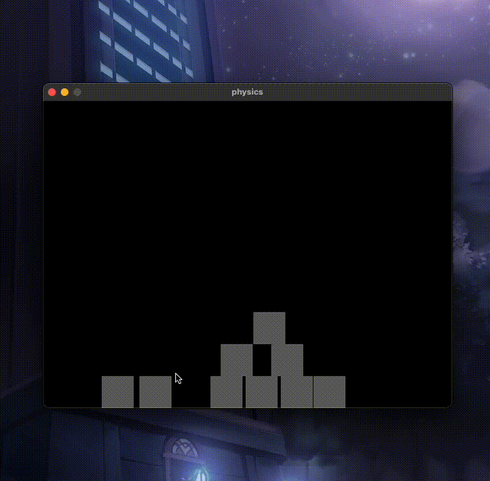

# 2D_Physics

  

A lightweight 2D physics engine written in C using SDL2 for rendering and input handling.

This project serves as a proof of concept for building a simple rigid body simulation from scratch, focusing on core physics principles and clean engine architecture.

Controls:
- Left Click (empty space) → Spawn a new square object
- Left Click + Hold (on object) → Drag object
- Release Click → Object resumes physics simulation

Features:
- Up to 10 square rigid bodies can be spawned
- Window boundary collision handling
- Basic object-to-object collision detection and response
- Interactive mouse dragging with physics state management
- Euler Integration for motion updates